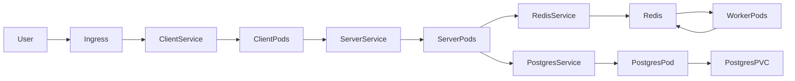

# 🚀 Fibonacci Calculator

## Containerized with Docker & Deployed on Kubernetes

This project demonstrates the complete lifecycle of a simple Fibonacci Calculator application — from containerization using Docker to deployment and orchestration on a local Kubernetes cluster.

It highlights modern DevOps practices including containerization, Kubernetes resource management, service exposure, scalability, and fault tolerance.

---

## 📌 Project Overview

The application calculates Fibonacci numbers and is deployed in a containerized environment to ensure portability and consistency across systems.

This project demonstrates:
- Docker-based containerization
- Kubernetes deployment using YAML manifests
- Service exposure and internal networking
- Load balancing and scalability
- Microservices-style deployment practices

---

## 🏗️ Architecture Diagram




## 🏗️ Architecture

```
+--------+
|  User  |
+--------+
     |
     v
+--------------------+
| Kubernetes Service |
+--------------------+
     |
     v
+--------------------+
|       Pod(s)       |
|  (Replica Set)     |
+--------------------+
     |
     v
+----------------------+
| Fibonacci Container  |
+----------------------+
```
- Docker encapsulates the application.
- Kubernete manages deployment, scaling and networking.
- Service provides stable access to the application.

---

## 🛠️ Technologies Used

- Docker
- Kubernetes (Local cluster - Kubectl / Kind / Docker Desktop)
- Linux CLI
- Container-based Microservice Architecture

---

## 🐳 Step 1: Containerization with Docker

1️⃣ Create Dockerfile

The Dockerfile defines:
